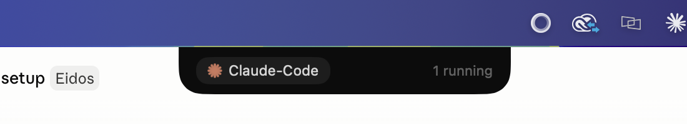

# Eidos Agents Dynamic Island

A native macOS app that puts a **Dynamic Island–style floating cockpit** at the top of your screen for monitoring and approving background AI agents (Claude Code, Codex, custom agents).

It runs as a faceless menu-bar-level panel (no Dock icon) and reacts in real time to agents talking to a tiny embedded HTTP server on `localhost:7799`.

The repo also includes a small product site at [product-site/index.html](product-site/index.html) with updated "Coming soon" messaging and a waitlist signup UI.



## States

| State | Trigger | Apple analogue |
|-------|---------|----------------|
| **idle** — 108×14 pill | no agents running | minimal |
| **mini** — 266×38 pill | 1 agent running | compact |
| **cockpit** — card | 2+ agents | expanded |
| **approval** — card | an agent requests `/approve` | expanded alert |

The island hangs from the top-center notch, transitions with a spring animation, and pulses a Claude sunburst mark while an agent is active. ⌘-drag to move it; double-click to recenter.

## Build & run

No full Xcode required — it compiles with the Command Line Tools via `swiftc`:

```bash
./build.sh --run      # compiles Eidos/**/*.swift into build/Eidos.app and launches it
```

If `swiftc` fails with `redefinition of module 'SwiftBridging'`, run `./fix-toolchain.sh` once (removes a stale CLT modulemap). With full Xcode installed you can instead `xcodegen generate && open Eidos.xcodeproj`.

## Link it to Claude Code

Hooks in `~/.claude/settings.json` make the island reflect Claude Code's own status live:

- `UserPromptSubmit` / `PreToolUse` → running (shows the current tool)
- `Notification` → surfaces a centered, auto-dismissing approval card (`eidos-notify.sh` → `/notify`)
- `Stop` → done → idle

See `eidos-hook.sh` and `eidos-notify.sh`.

## Event protocol (`localhost:7799`)

- `POST /event` — fire-and-forget status update `{agent, status, task, progress, elapsed}`
- `POST /approve` — synchronous long-poll; blocks until the user taps Approve/Reject
- `POST /notify` — transient, auto-dismissing approval card (non-blocking)
- `GET /status` — `{running, agents:[…]}`

`status` ∈ `running | paused | done | error`. Full spec in [CLAUDE.md](CLAUDE.md) and [BUILD_PLAN.md](BUILD_PLAN.md).

## Python integration

`eidos.py` is a drop-in for the OpenAI Agents SDK (`IslandHook`, `approval_tool`). Develop and test without the app using the dependency-free harness:

```bash
python3 mock_island.py          # stand-in island server
python3 test_protocol.py        # contract test (10/10)
.venv/bin/python test_eidos.py  # exercises eidos.py (12/12); needs httpx
```

## Layout

```
Eidos/            SwiftUI + AppKit sources (App, Models, Views, Window, Server)
build.sh          swiftc → Eidos.app
eidos.py          OpenAI Agents SDK integration
eidos-hook.sh     Claude Code status → island
eidos-notify.sh   Claude Code approval → island
mock_island.py    dependency-free island stand-in
test_*.py         protocol + integration tests
```

Personal dev tool — optimized for speed and correctness, not polish. Design reference: [Alcove](https://tryalcove.com).
